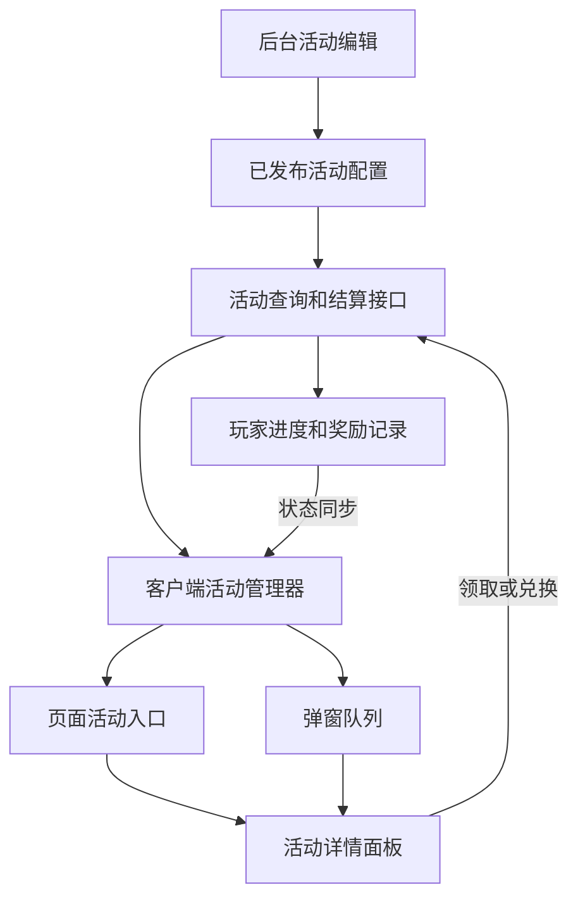

# TCG 活动系统详细设计方案

适用仓库：`TCGGameDem0`（Unity 客户端）与 `TCGCardDem0-Backend`（后端）

设计日期 2026 年 9 月 30 日

活动系统采用活动主表、各类型活动配置表、礼包奖励定义和玩家活动记录。后台管理完整活动配置，通过运行时接口同步客户端；客户端用统一管理器调度不同活动类型，并独立处理页面入口和弹窗展示。奖励结算由后端完成。

第一版支持公告、限时礼包、每日福利、累计登录和金币兑换。抽卡里程碑作为后续扩展。下文的字段、接口、类名和金额是设计建议；示意代码用于解释结构，活动功能为待实施设计。


**目录**

- [一 系统目标和现有基础](#一-系统目标和现有基础)
- [二 核心标识和数据分工](#二-核心标识和数据分工)
- [三 页面和弹窗展示](#三-页面和弹窗展示)
- [四 活动主表](#四-活动主表)
- [五 各类型活动配置表](#五-各类型活动配置表)
- [六 礼包定义和奖励明细](#六-礼包定义和奖励明细)
- [七 开启条件和状态](#七-开启条件和状态)
- [八 玩家记录和数据库约束](#八-玩家记录和数据库约束)
- [九 时间和每日重置](#九-时间和每日重置)
- [十 客户端类结构和统一调度](#十-客户端类结构和统一调度)
- [十一 HTTP 接口和同步流程](#十一-http-接口和同步流程)
- [十二 奖励领取和幂等](#十二-奖励领取和幂等)
- [十三 后台管理和发布](#十三-后台管理和发布)
- [十四 简单活动实例](#十四-简单活动实例)
- [十五 与现有仓库的接入位置](#十五-与现有仓库的接入位置)
- [十六 实施顺序和交付行为](#十六-实施顺序和交付行为)
- [十七 决策建议](#十七-决策建议)
- [十八 仓库依据](#十八-仓库依据)
- [附录 完整礼包活动响应示例](#附录-完整礼包活动响应示例)


## 一 系统目标和现有基础

后台可以配置活动名称、说明、类型、时间、参与条件、展示方式和奖励，经过发布后向符合条件的玩家开放。客户端登录或返回大厅时获取活动，定期同步变化；玩家领取奖励时，服务端再次检查活动和玩家状态。

| 现有模块 | 已确认能力 | 接入方式 |
| --- | --- | --- |
| GameConfigTables | 通用二进制表解析和 public 字段映射 | 用于已有静态配置和可选活动 CSV 导入 |
| PublishedGameConfig | 共享商品、卡池、卡牌配置与校验 | 用于校验活动引用的卡牌等资源 |
| LocalGameConfiguration | 登录前按 Addressables 标签加载配置 | 继续提供卡牌、多语言和活动界面资源 |
| ContentSession | 保存内容目标、配置哈希和服务器时间 | 复用内容上下文并增加活动时钟同步 |
| PlayerProfile | 金币、卡牌、UR 和玩家 Revision | 复用玩家数据及并发冲突检查 |
| SocialService | 礼品领取和卡牌库存结算 | 提取或复用奖励结算逻辑 |

当前 LocalGameConfiguration.CheckVersionAsync 没有实际查询新配置。后端 LatestContentService.ReadConfigAsync 会比较客户端 X-Config-Hash 与当前内容哈希，不一致时返回 CONTENT_CHANGED。活动时间和规则调整应使用独立的活动版本，不放进需要重启加载的静态内容哈希。

活动主表和类型子表以后台数据库为权威来源，客户端通过 JSON 接口接收。已有 CSV 和 Addressables 管理卡牌、商品、翻译及 UI 资源。活动表可提供 CSV 导入导出用于批量编辑，但导入也必须写入后台草稿并发布；客户端不同时维护第二份可独立覆盖的活动配置。

引用新卡牌、图片、翻译键或界面资源之前，先完成相应内容发布。活动查询和领奖请求继续携带现有内容目标及哈希；发生 CONTENT_CHANGED 时先走内容更新流程，不能在配置不一致时继续结算。


整体协作关系如下。页面与自动弹窗共用活动对象和操作接口，玩家记录由后端保存。



## 二 核心标识和数据分工

| 概念 | 示例 | 用途 |
| --- | --- | --- |
| ActivityId | national_day_gift_2026 | 标识这一场活动及其玩家记录 |
| ActivityType | Gift 或 SignIn | 选择活动业务处理类 |
| DisplayMode | Page 或 PageAndPopup | 控制入口及自动弹窗 |
| ScheduleMode | Permanent 或 Timed | 控制长期开放或限定时间 |
| DefinitionVersion | 第 3 版 | 控制活动定义的更新和领奖版本校验 |
| PopupPolicyVersion | 第 1 版 | 控制一次性弹窗是否允许重新展示 |
| PlayerStateRevision | 第 15 次状态变化 | 同步个人进度和领取状态 |

相同玩法的不同活动使用同一个类，例如国庆礼包和周末礼包都使用 GiftActivity，ActivityId 不同。每日福利也可以使用 GiftActivity，通过每日领取限制配置实现。页面展示方式和玩法分别配置，切换展示方式不改变活动身份或玩家领取记录。

一个时间有限的活动也可以一直保留在活动页面上；一个长期开放的活动也可以每天弹一次。页面常驻只表示入口位置，不表示活动永不过期。活动重办时创建新 ActivityId，不能复用旧 ID 清空历史记录。

## 三 页面和弹窗展示

### 三点一 展示变量

建议使用 DisplayMode 整数枚举，预留页面与弹窗同时展示这一常见模式。下面是拟新增的示意代码，数据库和兼容 CSV 行保存整数，在运行时转换为枚举。

```csharp
public enum ActivityDisplayMode
{
    Page = 0,          // 活动页面保留入口
    Popup = 1,         // 按规则自动弹窗
    PageAndPopup = 2   // 页面入口与弹窗同时存在
}

public int DisplayMode; // 共享配置行使用 public 字段
```

| 模式 | 页面行为 | 自动展示行为 |
| --- | --- | --- |
| Page | 符合可见规则时保留活动入口 | 不自动弹窗，玩家点击打开详情 |
| Popup | 不放入常规活动页面列表 | 按触发时机、频率和优先级弹出 |
| PageAndPopup | 保留活动入口，可随时重新打开 | 符合规则时也自动弹出 |

第一版将有奖励的自动弹出活动默认设置为 PageAndPopup。一次性 Popup 适用于公告；需要玩家手动领奖的活动如果只弹一次，关闭后会失去领取入口，因此发布校验应要求改为 PageAndPopup。常驻入口可以放在大厅活动栏，点击后再打开模态面板；面板打开方式与是否自动弹出分开处理。

### 三点二 弹窗配置

| 字段 | 建议值 | 说明 |
| --- | --- | --- |
| PopupTrigger | LobbyReady 或 RewardClaimable | 大厅就绪或奖励从不可领变为可领时评估 |
| PopupFrequency | OncePerActivity 或 OncePerDay | 按活动实例一次，或服务器自然日一次 |
| PopupPriority | 整数，值大优先 | 同批候选活动的弹出顺序 |
| PopupPolicyVersion | 初始为 1 | 只有明确重新通知时才增加 |
| StopPopupWhenCompleted | true | 当前可领取内容完成后停止自动弹出 |

第一版默认只在大厅安全时机自动弹出，战斗、抽卡动画、网络请求中的确认面板等场景不弹。每次大厅会话最多自动展示 3 个活动，逐个显示，不叠加；剩余候选保留到后续安全时机或通过页面入口访问。弹窗队列按优先级降序、页面排序升序、ActivityId 升序稳定排序。

真正打开并显示成功后才记录已展示，排队或资源尚未打开不算。客户端立即记录当前会话内的展示结果，并向后端报告；长期展示记录按玩家、活动、弹窗策略版本及日周期保存。改描述、排序或延长结束时间不会自动清除展示记录。领取奖励记录和展示记录独立，关闭面板不会视为领取。

队列中的活动被下架、过期或已完成时移除；当前面板如果活动状态变化，刷新状态并禁用操作按钮。当前抽卡或领奖请求已经发出时等待服务端结果，再更新界面。多设备可能在展示回执提交前同时弹出，这是展示体验上的竞争，不影响领奖次数；第一版不承诺弹窗跨设备严格只展示一次。

## 四 活动主表

ActivityDefinition 为活动主表。保留你提出的活动 ID、描述、类型、开始时间、结束时间和开启条件，并增加展示、发布和同步字段。表中字段是后台活动定义；后端算出的玩家资格和可领取状态另外返回。

| 字段 | 类型 | 用途 |
| --- | --- | --- |
| Id | string 主键 | 活动 ID，发布后固定 |
| Name | string | 后台和客户端活动名称 |
| Description | string | 活动说明 |
| NameKey / DescriptionKey | 可空 string | 可选的已发布多语言键 |
| Type | int | 公告 0、礼包 1、签到 2、兑换 3、里程碑 4 |
| PublishStatus | int | 草稿、已发布、已下架 |
| ScheduleMode | int | Permanent 0、Timed 1 |
| StartsAt / EndsAt | 可空 DateTimeOffset | 限时活动必须都有，长期活动都为空 |
| OpenConditionsJson | string | 结构化参与条件 |
| DisplayMode | int | Page 0、Popup 1、PageAndPopup 2 |
| SortOrder | int | 页面排序，值小靠前 |
| BannerResourceKey | 可空 string | 已发布活动图资源地址 |
| ShowBeforeStart | bool | 是否提前展示并显示开始倒计时 |
| HideWhenCompleted | bool | 整个活动永久完成后隐藏入口 |
| ShowLocked | bool | 条件不满足时是否显示锁定入口 |
| DefinitionVersion | long | 每次发布更新递增 |
| CreatedAt / UpdatedAt | DateTimeOffset | 后台维护时间 |

弹窗字段采用上一节的 PopupTrigger、PopupFrequency、PopupPriority、PopupPolicyVersion 和 StopPopupWhenCompleted，可以先放在主表，无需单独建一张展示表。后台页面只在选择 Popup 或 PageAndPopup 时展示这些配置。

PublishStatus 作为发布开关的唯一字段，避免再存一份容易与之矛盾的 IsEnabled。运行状态由发布时间、上下架和服务器时间计算，不需要定时任务逐条写入“进行中”。客户端 DTO 可返回 Status，数据库不把它当可手工修改的权威值。

Timed 活动使用开始包含、结束不包含的区间，即 StartsAt <= serverNow < EndsAt。在 EndsAt 对应时刻领取会被拒绝。后台按北京时间显示，保存 UTC 时间；JSON 使用带时区的 ISO 8601。示例排期为 2026-10-01T00:00:00+08:00 至 2026-10-08T00:00:00+08:00，覆盖 10 月 1 日至 7 日。

HideWhenCompleted 只在该活动不会再产生可领取内容时生效。每日礼包今天领完以后，页面继续显示“今日已领取”，等待次日重置；不能把当天领完解释为整个活动完成。

## 五 各类型活动配置表

### 五点一 公告活动表

ActivityNoticeConfig 与主表为一对一关系，ActivityId 是主键和外键。字段包括 Content、ImageResourceKey、ActionKind、ActionTarget；第一版 ActionKind 仅支持关闭或跳转到客户端已支持的活动 ID。公告不带奖励、不生成领取记录。它可以使用纯 Popup 模式展示一次。

### 五点二 礼包活动表

| 字段 | 类型 | 用途 |
| --- | --- | --- |
| Id | string 主键 | 活动内某个礼包配置项的 ID |
| ActivityId | string 外键 | 关联活动主表 |
| Description | string | 这个礼包的补充说明 |
| GiftId | string 外键 | 引用礼包定义 |
| PeriodKind | int | WholeActivity 或 Daily |
| LimitPerPeriod | int | 本周期每位玩家可领取次数 |
| TotalLimit | 可空 int | 整个活动上限；为空表示不另设总上限 |
| SortOrder | int | 礼包行展示排序 |

主表与礼包活动表是一对多关系。一场活动可以展示多个礼包。你的“礼包奖励”通过 GiftId 查询奖励明细，客户端收到活动详情时由后端一次性展开，不需要分别请求四张表。第一版礼包免费领取；花金币购买固定卡牌使用兑换类型，避免礼包领取和兑换购买出现两套相同逻辑。

### 五点三 累计登录活动表

ActivitySignInConfig 每个活动一条，保存 ActivityId、RequiredDays、AllowCatchUpClaims。ActivitySignInReward 保存 Id、ActivityId、DayIndex、GiftId、SortOrder，按累计登录第几天关联礼包。建议 AllowCatchUpClaims=true，满足的历史档位在活动结束前仍可领取。

累计登录按活动期间的不同服务器自然日统计，不要求连续。活动正在进行且玩家符合参与条件时，每天的首次有效大厅访问新增一次进度，重复登录不增加。DayIndex 必须从 1 开始连续覆盖 RequiredDays；每个档位一次，档位领取不减少累计天数。连续签到属于另一套规则，第一版不混入这一活动。

### 五点四 兑换活动表

ActivityExchangeOffer 是一对多配置，保存 Id、ActivityId、Description、CostGold、GiftId、PeriodKind、LimitPerPeriod、TotalLimit、SortOrder。第一版只支持金币支付，兑换结果是固定礼包。后台校验 CostGold > 0，奖励至少一项，次数上限为正数。

扣金币、增加库存、累计兑换次数和保存操作结果必须一次提交。领取接口和兑换接口分别命名，避免客户端把付费兑换当成免费领奖。若未来增加 UR 或道具支付，再引入结构化 Cost 明细及对应服务端处理。

### 五点五 抽卡里程碑表

ActivityMilestoneConfig 保存 ActivityId、MetricType、PackIdsJson；ActivityMilestoneReward 保存 Id、ActivityId、Threshold、GiftId。MetricType 第一种为 GachaDrawCount，Threshold 例如 10 和 30。只累计指定卡包中已经成功提交结算的抽卡数量。

现有 GachaService 负责随机抽取，不能仅在随机结果生成后增加进度。进度更新必须接在玩家扣费和库存更新成功的结算路径，同一事务中增加；一次十连计 10，失败和幂等重试计 0 次额外进度。该活动放在第二阶段，以免第一版与抽卡结算同时改动。

## 六 礼包定义和奖励明细

GiftDefinition 保存 Id、Name、Description；GiftReward 保存 Id、GiftId、RewardType、RewardId、Amount、CardVariant。一个礼包对应多条奖励。礼包定义 ID 可以采用 gift_gold_1000_v1 这样的字符串，使版本含义可读。

| 奖励类型 | RewardId | Amount | 结算规则 |
| --- | --- | --- | --- |
| Gold 1 | gold | long，必须大于 0 | 增加 PlayerProfile.Gold，检查溢出 |
| Card 2 | 已发布的卡牌或异画 ID | 正整数，必须在 int 范围内 | 沿用卡牌库存上限及 UR 转换规则 |

第一版不配置抽卡券、虚拟道具或经验，当前玩家数据没有这些通用库存定义。UR 可作为现有卡牌重复转换的结算结果返回；如果要直接奖励 UR，再增加显式奖励类型及校验。CardVariant 必须明确映射仓库 OwnedCard.Rarity 所表达的卡牌版本或效果编码，不能仅凭字段名假设它代表常见的 N、R、SR 稀有度。

固定卡牌奖励应复用 CardInventorySettlement.Grant，保留卡牌 ID 解析、异画解锁、持有上限和重复卡转换逻辑。发奖后返回实际奖励摘要，包括 UR 转换结果，使界面展示的结果与库存一致。示例中的现有卡牌 ID 在上线配置时从实际卡牌表选择。

已经被已发布活动引用的礼包定义冻结，改奖励时复制为新 GiftId 并用于新活动。避免同一个礼包 ID 的奖励随时变化，导致玩家先看到一份奖励，点击时得到另一份。活动领奖默认直接入账；现有 Social.Gift 表保存的是发给具体玩家的礼品，不能作为礼包模板表。如果以后要投递收件箱，应建立唯一投递记录并采用该路径结算，不能同时直接发奖再生成一份可领取礼品。

## 七 开启条件和状态

### 七点一 条件结构

OpenConditionsJson 保存结构化规则，后台用表单生成，第一版支持 AllOf，即所有条件都满足。它不保存可执行 C#、Lua 或任意表达式。空条件表示只要求已登录并具有有效玩家资料。

```json
{
  "allOf": [
    { "type": "ownedCardKindsAtLeast", "value": 5 },
    { "type": "activityCompleted", "activityId": "intro_gift" }
  ]
}
```

| 条件类型 | 数据来源 | 第一版规则 |
| --- | --- | --- |
| ownedCardKindsAtLeast | 后端玩家库存 | 按基础 CardId 去重，持有数量必须大于 0 |
| activityCompleted | 后端活动记录 | 只能引用有明确永久完成状态的活动 |
| playerCreatedBefore / After | PlayerProfile.CreatedAt | 明确使用资料创建时间，不冒充账号注册时间 |

当前 PlayerProfile 没有等级和任务完成字段，因此第一版不启用等级门槛、主线任务门槛或战斗胜利条件。以后增加这些服务端数据后，再注册对应条件处理器。后台发布时校验条件类型、数值范围、引用活动和依赖环；不支持的条件不能直接上线。

资格由后端计算并返回 Eligible、LockedReasonCode、LockedReasonText。客户端可以显示条件说明，但最终领取时必须由后端重新检查。活动依赖采用永久完成标识，例如一次礼包全部领取或累计登录全部档位领取；每日福利的“今日已领”不用于永久前置条件。

### 七点二 状态分开保存和计算

| 状态维度 | 可能值 | 判断来源 |
| --- | --- | --- |
| 发布状态 | Draft / Published / Disabled | 后台主表 |
| 时间状态 | Upcoming / Running / Ended | 服务器时间与活动区间 |
| 玩家资格 | Eligible / Locked | 服务器条件校验 |
| 领取项状态 | Locked / Claimable / Claimed / LimitReached | 进度和领取计数 |
| 永久完成状态 | Completed 或未完成 | 活动类型处理器 |

发布且正在进行不等于当前玩家能领取。界面先显示时间和资格，再按领取项显示按钮。领取按钮启用条件为活动可用、玩家符合条件、领取项可领、内容配置匹配及当前没有同一操作正在请求。弹窗出现和页面可见都不会改变这些状态。

## 八 玩家记录和数据库约束

| 表 | 主要字段 | 用途 |
| --- | --- | --- |
| PlayerActivityProgress | PlayerId、ActivityId、Metric、Value、Revision | 累计登录、累计抽卡等进度 |
| PlayerActivityVisit | PlayerId、ActivityId、ServerDay | 每天首次有效访问记录 |
| PlayerActivityCounter | PlayerId、ActivityId、EntryId、PeriodKey、Count | 周期及总次数限制 |
| PlayerActivityClaim | ClaimId、PlayerId、ActivityId、EntryId、PeriodKey、Ordinal、Version、RewardSnapshot、CreatedAt | 已经结算的领取或兑换明细 |
| PlayerActivityPopup | PlayerId、ActivityId、PolicyVersion、PeriodKey、ShownAt | 弹窗展示回执 |
| ActivityOperation | PlayerId、RequestId、PayloadHash、ResponseJson、CreatedAt | 幂等请求结果 |
| ActivityPublishHistory | ActivityId、Version、操作人、配置快照、发布时间 | 后台版本与修改历史 |

PlayerActivityVisit 在 PlayerId + ActivityId + ServerDay 上建立唯一约束。签到计数只在首次插入成功时增加，避免两个设备在同一天重复增加进度。抽卡事件若采用事件投递，应使用已经结算的业务操作 ID 去重；第一版里程碑优先与抽卡结算同事务写入。

次数计数在 PlayerId + ActivityId + EntryId + PeriodKey 上唯一；全活动周期用固定 PeriodKey=all，每日周期用 YYYY-MM-DD。同时配置每日及总次数时分别检查两种计数，成功操作一并更新。领取明细按上述主键再加 Ordinal 唯一，允许限领次数大于 1；Ordinal 由服务端分配，客户端不指定。一次性档位的 Ordinal 固定为 1。

ActivityOperation 在 PlayerId + RequestId 上唯一，相同请求 ID 和相同参数返回已保存的结果，参数不同返回冲突。业务次数约束独立于 RequestId，换一个请求 ID 也不能绕过领取上限。一次发奖的玩家数据、次数计数、领取明细和操作结果必须在同一数据库事务中提交。

领取历史不能因活动下架、修改时间或恢复发布而清空。后台归档保留历史，第一版不提供“重置全体玩家领取次数”按钮。若活动需要新一轮，复制活动并使用新 ActivityId。

## 九 时间和每日重置

后端使用服务器 UTC 时间判定活动开始结束。第一版每日周期固定为北京时间 00:00 重置，即 UTC+08:00；弹窗每日频率和每日礼包采用同一自然日定义。活动发布后不修改这一定义，避免相同时间点被解释成两个领取周期。

示意代码如下，服务端计算 periodKey，客户端使用响应中的 ServerDay 和 NextResetAt 展示。领取请求同时携带当前 PeriodKey，跨零点的旧请求返回周期变化，要求刷新并由玩家重新确认，不能直接替玩家领取新一天。

```csharp
DateTimeOffset now = timeProvider.GetUtcNow();
string periodKey = now.ToOffset(TimeSpan.FromHours(8))
    .ToString("yyyy-MM-dd");
bool running = startsAt <= now && now < endsAt;
```

客户端保存服务器时间及收到响应时的单调时钟读数，用经过的时间估算当前服务器时间。倒计时到零时刷新状态和接口，而不是依赖 Windows 或手机的本地日期。暂停、恢复、重新登录后重新同步；活动是否可领仍由服务端判断。

周期重置采用按 periodKey 查询新计数行，不需要在凌晨清零全表。玩家前一天未领的每日礼包不会自动补发；累计登录的已解锁档位可以在结束前补领。第一版所有领奖窗口与活动结束时间一致，不额外设计活动结束后的领奖宽限期。

## 十 客户端类结构和统一调度

### 十点一 数据和行为

共享 ActivityDefinitionDto、各类型配置 DTO、奖励 DTO、玩家状态 DTO 和条件协议放在后端可引用的普通 C# 文件中，不依赖 UnityEngine。DTO 使用明确 public 字段及统一 JSON 命名规则；后端实体可使用属性，不能把 EF 实体直接暴露给客户端。若采用 CSV 导入，映射行也使用 public 字段，枚举保存 int，日期保存带时区字符串。

客户端 ActivityManager、活动处理器、页面和弹窗调度放在现有可热更新代码集中。共享 DTO 只是数据协议；具体放置时核对现有程序集引用，不能把客户端活动逻辑放到 AOT。UI 沿用现有界面框架，组件通过序列化字段在 Inspector 绑定。

```csharp
// 示意接口，Snapshot 包含定义、类型配置和玩家状态
public interface IActivity
{
    string Id { get; }
    int Type { get; }
    void Apply(ActivitySnapshot snapshot);
    void Tick(DateTimeOffset serverNow);
    bool HasClaimableReward { get; }
    void Dispose();
}

// 同一种玩法复用类，展示方式由统一展示模块处理
registry[0] = () => new NoticeActivity();
registry[1] = () => new GiftActivity();
registry[2] = () => new SignInActivity();
registry[3] = () => new ExchangeActivity();
```

| 模块 | 职责 |
| --- | --- |
| ActivityApi | 查询活动、报告访问、领取、兑换、提交展示回执 |
| ActivityStore | 保存已安装的完整活动快照及版本 |
| ActivityManager | 按 ID 创建更新移除对象，派发状态变化 |
| ActivityClock | 根据服务器时间和单调时钟提供倒计时 |
| Gift / SignIn / Exchange / Notice Activity | 各玩法的进度解释和交互请求 |
| ActivityPagePresenter | 页面列表、入口排序、锁定说明和红点 |
| ActivityPopupScheduler | 弹窗候选、优先级、频率和安全时机 |
| ActivityViewRouter | 按玩法选择对应面板，绑定统一活动快照 |

### 十点二 同步与生命周期

收到完整列表后，管理器比较 ActivityId 集合：新增对象按 Type 创建，已有对象 Apply 更新，响应中不再存在的对象移除并 Dispose。全部数据和引用校验后原子替换快照，再通知 UI；避免只更新活动时间却仍展示旧礼包。临时请求失败保持最后一次已安装快照并标注需刷新，无法确认服务器状态时停止领奖。

发布后不允许修改活动 Type。客户端发现相同 ID 的类型变化视为协议错误并停止该活动操作，后台应在发布环节阻止这种配置。退登时取消请求、关闭面板、清空对象和当前会话展示状态；新账号不能继承上一个账号的玩家领取数据。

HTTP 同步同一时间只执行一份，响应安装检查当前账号和会话标识，避免旧账号请求迟到。UI 每秒刷新倒计时即可；网络每 60 秒同步，不需要每帧请求。配置或领奖更新期间不在遍历对象集合时直接增删，统一在同步阶段处理。

### 十点三 页面和弹窗的共同操作

```csharp
// 示意调度代码
bool inPage = mode == ActivityDisplayMode.Page
    || mode == ActivityDisplayMode.PageAndPopup;
bool canAutoPopup = mode == ActivityDisplayMode.Popup
    || mode == ActivityDisplayMode.PageAndPopup;

if (inPage) pagePresenter.UpdateEntry(snapshot);
if (canAutoPopup) popupScheduler.Evaluate(snapshot);
```

点击页面入口和自动弹窗都调用同一个 ViewRouter.Open(activityId)，绑定相同对象。领取成功后该对象更新，页面红点与已打开弹窗同时刷新。领取请求由玩法处理器发起，界面只提交领取项 ID，不自行增加金币或卡牌。

## 十一 HTTP 接口和同步流程

### 十一点一 客户端接口

| 方法和路径 | 用途 |
| --- | --- |
| GET /api/activities | 完整活动定义、展开的玩法配置、玩家状态及弹窗资格 |
| GET /api/activities/{id} | 打开详情时刷新单个活动 |
| POST /api/activities/visit | 记录当前服务器日的有效大厅访问 |
| POST /api/activities/{id}/claim | 免费礼包或已解锁签到档位领奖 |
| POST /api/activities/{id}/exchange | 金币兑换固定礼包 |
| POST /api/activities/{id}/popup-shown | 记录实际显示成功的弹窗 |

所有玩家接口通过现有登录认证识别玩家，不接受客户端任意传入 PlayerId。请求继续携带 X-Content-Target 和 X-Config-Hash，并声明 ActivitySchemaVersion 与 SupportedActivityTypes。服务端只发送该客户端支持且资源兼容的活动，后台发布时也限制目标平台和必要资源。

第一版 GET /api/activities 每次返回完整快照，60 秒周期下先保证简单正确。活动配置版本相同也要返回最新玩家进度，因为第二个设备可能已领奖；不能仅比较定义版本就复用全部旧状态。今后可把公共定义和私有玩家状态拆成两个接口分别缓存，不能将登录状态响应放入共享缓存。

```jsonc
// 示意响应结构
{
  "schemaVersion": 1,
  "definitionsRevision": 12,
  "playerStateRevision": 7,
  "serverTime": "2026-10-01T00:00:00Z",
  "serverDay": "2026-10-01",
  "nextResetAt": "2026-10-02T00:00:00+08:00",
  "activities": [
    {
      "id": "national_day_gift_2026",
      "type": 1,
      "definitionVersion": 3,
      "displayMode": 2,
      "status": "running",
      "eligible": true,
      "entries": [],
      "playerState": {},
      "popup": { "shouldShow": true }
    }
  ]
}
```

响应中的 entries 在正式协议中按活动类型包含礼包、档位或兑换项。后端一次性展开对应奖励，前端收到后即可显示；示例的空数组仅用于说明外层结构，不代表可发布的完整领奖活动。

### 十一点二 同步触发时机

1. 登录并进入大厅：报告有效访问，获取完整活动列表，然后计算页面和弹窗候选。

2. 打开活动页面或详情：刷新定义和玩家状态，再显示可领取按钮。

3. 在前台运行：每 60 秒同步，后台或暂停时停止轮询，恢复后立即同步。

4. 开始、结束或每日重置边界：本地更新倒计时并立即刷新接口确认。

5. 领取、兑换或计数业务完成：更新响应中的活动状态和玩家库存，再刷新相关入口。

6. 后台下架：下次同步移除入口和待弹候选；旧界面发出的请求由后端即时拒绝。

HTTP 拉取意味着后台修改对在线界面的可见延迟通常最多一个轮询周期，加上网络时间；暂停客户端到恢复后更新。领取接口读取当前发布版本，不等待客户端轮询，所以已下架或到期活动不能继续结算。第一版无需 WebSocket。

## 十二 奖励领取和幂等

### 十二点一 请求和响应

```jsonc
// 示意领取请求，奖励内容由服务器查询
{
  "entryId": "national_day_free_gift",
  "expectedDefinitionVersion": 3,
  "expectedPlayerRevision": 25,
  "periodKey": "all",
  "requestId": "一次操作生成的唯一标识"
}
```

客户端点击一次生成一次 RequestId，按钮进入请求中状态。网络超时后重试沿用原 RequestId，保持原请求参数；状态确实改变而重新确认操作时才使用新 ID。请求不提交奖励数量、金币增量或卡牌列表。

成功响应包含 OperationId、是否为已完成操作的重放、当前领取项状态、实际奖励摘要、Player 或最新玩家修订号，以及 ServerTime。如果幂等重放返回较旧的玩家快照，客户端不能覆盖本地更高 Revision 的库存，应重新查询当前玩家数据。

### 十二点二 服务端事务

1. 认证玩家，按 PlayerId + RequestId 检查已完成操作；同参直接返回结果，异参拒绝。

2. 开始数据库事务，读取当前发布活动、类型配置及服务器时间。

3. 检查客户端内容哈希、活动版本、开放区间、参与条件、PeriodKey 和领取档位。

4. 检查玩家 Revision、周期次数及总次数；兑换时另检查金币余额。

5. 根据 GiftId 读取冻结奖励，复用库存结算规则，计算金币、卡牌和 UR 变化。

6. 保存玩家变化、领取计数、奖励快照、操作结果和进度，一并提交。

7. 返回实际奖励和更新后的状态；事务失败不保留一半领取记录或一半库存变化。

已完成幂等结果在当前时间、版本和次数检查之前识别，因此一笔在结束前已经成功的请求，结束后重试仍能获得原结果。新的请求则按最新状态校验。后台发布与领奖需采用能确定先后顺序的事务或版本并发控制；不能在校验活动仍开放后，又在另一段未受保护的写入中发奖。

同时使用数据库唯一约束、玩家 Revision 并发检查以及事务。SQLite 写入竞争或 EF 并发冲突返回明确的刷新重试结果，不能自动跳过校验。业务领取上限对换 RequestId 和多设备并发依旧有效。

| 错误码建议 | 客户端行为 |
| --- | --- |
| ACTIVITY_NOT_STARTED / ACTIVITY_ENDED | 刷新倒计时与状态，停止领取 |
| ACTIVITY_DISABLED | 移除入口和待弹候选，说明已下架 |
| ACTIVITY_CONDITION_NOT_MET | 显示未满足条件 |
| ACTIVITY_ALREADY_CLAIMED / LIMIT_REACHED | 同步领取状态，禁用当前项 |
| ACTIVITY_VERSION_CHANGED / PERIOD_CHANGED | 刷新配置或周期，重新确认操作 |
| PLAYER_DATA_CHANGED | 刷新玩家数据和活动状态 |
| INSUFFICIENT_GOLD | 显示金币不足，保留兑换项 |
| CONTENT_CHANGED | 转入现有内容更新流程 |
| REQUEST_ID_CONFLICT | 说明操作参数冲突，停止自动重试 |

## 十三 后台管理和发布

管理页面建议增加活动列表、活动编辑、礼包定义和发布历史四部分。列表显示名称、类型、展示模式、时间区间、发布状态及定义版本；筛选可以使用类型、是否正在开放、页面或弹窗和发布状态。

编辑页面按基本信息、排期与条件、展示设置、玩法配置及奖励预览组织。选择类型后只显示对应子表编辑器；礼包允许增加多行，累计登录按天显示档位，兑换按商品显示价格和限额，公告显示内容和跳转目标。奖励预览直接展示金币与卡牌，而不是要求操作者手填不可见的 JSON。

管理员先保存草稿，发布时进行完整结构与引用校验，并在一次事务中切换为新的完整发布快照。玩家接口不读取正在编辑的半成品。可采用 ActivityDefinition 的 ActiveVersion 指向不可变 ActivityPublishedVersion；具体类型行与主表属于同一个发布版本，避免礼包子表更新而主表版本仍旧。

1. 检查活动 ID、类型、时间区间、展示模式及弹窗规则是否合法。

2. 检查各类型子表数量、主外键、礼包引用、奖励数量和领取限额。

3. 检查条件类型和活动依赖，禁止循环依赖。

4. 检查必要卡牌、资源地址及翻译键已在目标内容中存在。

5. 检查每日周期和领奖次数语义；奖励弹窗一次后无入口的配置不可发布。

6. 生成并保存新定义版本，更新公共定义修订号，保留操作历史。

发布后可以修改名称、描述、排序、展示方式、开始结束时间和参与条件，发布为新版本后生效，玩家历史保持。活动已产生进度后不修改起始时间来重新解释已累计数据；延长或缩短结束时间可以作为明确运营操作，但不能复活已经领取的档位。开始时间、活动类型、每日周期、成本、奖励和领取项身份在产生玩家记录后冻结，需要变化时复制新活动。

下架只改变可用性，恢复同一 ID 后继续原来的进度。回退配置版本也不能回退玩家库存或删除领奖记录；涉及玩法和奖励结构时创建新实例。管理员接口沿用现有管理员认证，并校验 ExpectedVersion 防止两人编辑覆盖。

| 管理接口建议 | 用途 |
| --- | --- |
| GET /api/admin/activities | 查询活动列表和管理状态 |
| POST /api/admin/activities | 创建活动草稿 |
| PUT /api/admin/activities/{id} | 更新完整草稿，携带 ExpectedVersion |
| POST /api/admin/activities/{id}/publish | 校验并发布新快照 |
| POST /api/admin/activities/{id}/disable | 即时下架 |
| POST /api/admin/activities/{id}/copy | 以新 ID 复制活动 |
| GET /api/admin/activities/{id}/history | 查看发布历史 |

## 十四 简单活动实例

下列日期和金额是演示配置。实际卡牌奖励从现有卡牌表选择，整体奖励数值在上线前再按游戏经济调整。不同活动的礼包定义可以复用，但玩家领取次数分别记录。

| 活动 | 类型 | 展示方式 | 主要规则 |
| --- | --- | --- | --- |
| 国庆活动公告 | Notice | Popup | 活动期间首次大厅访问展示一次，无奖励 |
| 国庆见面礼 | Gift | PageAndPopup | 7 天内每人领取 1000 金币一次 |
| 每日免费金币 | Gift | Page | 长期开放，每天领取 200 金币一次 |
| 累计三日登录 | SignIn | PageAndPopup | 不同自然日登录解锁三档奖励 |
| 每日金币兑换 | Exchange | Page | 每天可花 800 金币换固定卡牌一次 |
| 抽卡十次奖励 | Milestone | Page | 指定卡包成功抽取 10 次后领奖一次 |

### 十四点一 国庆活动公告

ActivityId=notice_national_day_2026，Type=Notice，ScheduleMode=Timed，排期为 10 月 1 日至 7 日，DisplayMode=Popup，PopupTrigger=LobbyReady，PopupFrequency=OncePerActivity，PopupPriority=100。内容说明礼包与累计登录活动，按钮可跳转 national_day_gift_2026。弹窗显示后记录回执，关闭不产生领取记录。

### 十四点二 国庆见面礼

ActivityId=national_day_gift_2026，Type=Gift，DisplayMode=PageAndPopup，PopupFrequency=OncePerActivity，PopupPriority=90。配置一行免费礼包，GiftId=gift_gold_1000_v1，PeriodKind=WholeActivity，LimitPerPeriod=1。符合条件的玩家领取后按钮显示“已领取”，红点消失，页面可以按 HideWhenCompleted 隐藏。

客户端点击领取项，服务器在活动时间内增加 1000 金币，记录该项全活动周期计数 1。断线重试返回原结果；同一玩家再次用新请求 ID 领取也会因次数上限被拒绝。活动结束时入口按展示规则移除，未领取奖励不自动补发。

### 十四点三 每日免费金币

ActivityId=daily_gold，Type=Gift，ScheduleMode=Permanent，StartsAt 与 EndsAt 为空，DisplayMode=Page。GiftId=gift_gold_200_v1，PeriodKind=Daily，LimitPerPeriod=1，TotalLimit 为空。今天领取后显示“今日已领取”和下次重置时间；第二天的计数行按新 PeriodKey 查询，重新出现可领取红点。

这里的长期开放由 ScheduleMode 决定，页面常驻由 DisplayMode 决定，两者分别可修改。若希望每日登录时提醒一次，可改为 PageAndPopup + OncePerDay，停止弹出的判断使用当天是否已领取。

### 十四点四 累计三日登录

ActivityId=login_three_days_2026，Type=SignIn，Timed，排期为 10 月 1 日至 7 日，DisplayMode=PageAndPopup。累计第 1、2、3 个有效登录日分别解锁 100、200、500 金币礼包；每档一次，可以在活动结束前补领已经解锁的历史档。

玩家 10 月 1 日、3 日和 5 日进入大厅，累计天数依次为 1、2、3。10 月 1 日登录十次仍只计一天。玩家到第 3 天才打开活动页，仍可以分别领取三个档位。全部档位领取后才判定该活动永久完成，单纯达到 3 天不等于奖励全部领完。

### 十四点五 每日金币兑换

ActivityId=daily_card_exchange，Type=Exchange，Permanent，DisplayMode=Page。配置一个 OfferId=exchange_offer_001，CostGold=800，GiftId 指向一张已有固定卡牌，PeriodKind=Daily，LimitPerPeriod=1。页面清楚展示消耗金币和奖励卡牌，按钮文字使用“兑换”。

金币不足不能兑换。成功后扣 800 金币，按库存规则增加卡牌或转换为 UR，并记录当天次数；玩家资产与次数一并提交。卡组、异画和重复转换规则沿用现有库存实现，不能绕过库存结算直接向 List 加一张卡。

### 十四点六 抽卡十次奖励

ActivityId=draw_ten_reward_2026，Type=Milestone，Timed，DisplayMode=Page。指定参与卡包列表，累计成功抽卡 10 次解锁 500 金币，档位只可领取一次。可以增加累计 30 次奖励 1500 金币的第二档，10 次和 30 次档位分别记录。

进度从本活动开始后且玩家具备参与资格的成功抽卡结算累计；发布前已有的抽卡不追溯统计。一笔十连计 10，服务器未提交成功的抽卡计 0；重放同一抽卡操作不增加新进度。第一版先完成其他活动，第二阶段接入这一业务事件。

## 十五 与现有仓库的接入位置

| 位置 | 建议变更 |
| --- | --- |
| Assets/Shared/Configuration | 新增普通 C# 活动协议和公共条件定义，核对热更新程序集引用 |
| Assets/Scripts/Network | 按现有 HTTP 写法增加活动 API 和活动快照同步 |
| 可热更新的活动模块 | ActivityManager、各玩法处理器、时钟、展示调度 |
| 现有 UI 目录 | 活动列表、礼包、签到、兑换、公告面板及序列化引用 |
| 后端 Features/Activities | 实体、DTO 转换、条件处理、查询、发布和结算服务 |
| 后端 AppDbContext 和迁移 | 活动定义、类型配置、进度、次数、领奖和回执表 |
| AdminWeb/src | 活动列表、编辑、礼包定义及发布历史页面 |
| 后端库存结算 | 复用 CardInventorySettlement 与玩家 Revision 规则 |

后端项目目前通过 Compile Include 引用 Unity 的配置源码和 Assets/Shared/Configuration 下的文件。新增 DTO 若放入已有通配包含目录，后端可编译同一份定义；若放到新目录，则显式更新后端 csproj。实际程序集和 UI 接入路径要按现有同类模块确定，保持客户端逻辑与无 Unity 依赖的数据协议分离。

第一版活动接口直接返回 JSON，不必修改 BinaryTable 的编码协议，也不必把所有活动表加进启动必需配置列表。如果增加活动 CSV 导入，需单独定义活动行结构并增加主外键与奖励校验；新 CSV 可被通用加载器解析不等于活动业务自动实现。

## 十六 实施顺序和交付行为

| 阶段 | 工作内容 | 完成后的行为 |
| --- | --- | --- |
| 1 核心配置 | 共享 DTO、数据库表、后台草稿和发布 | 后台能完整配置并发布活动 |
| 2 展示与同步 | 完整列表接口、管理器、页面和弹窗队列 | 修改排期和展示模式后客户端刷新 |
| 3 基础领奖 | 固定礼包、每日福利、幂等和库存结算 | 按一次或每日限额领取金币和卡牌 |
| 4 签到与兑换 | 访问计数、档位奖励、金币交易 | 累计登录解锁档位，兑换原子结算 |
| 5 业务里程碑 | 抽卡结算事件和进度去重 | 成功抽卡数量驱动活动奖励 |

第一版的具体完成目标是：后台能发布、修改和下架活动；客户端按展示模式保留入口或排队弹窗；时间、条件、周期和领取状态都有明确解释；奖励由服务端计算，重复请求和多设备不增加额外奖励；每日福利次日重新开放，累计登录可补领已经解锁的档位。

典型使用场景包括活动开始与结束边界、弹窗关闭后从页面重开、活动临时下架、条件不满足、重复点击、网络超时重试、跨零点请求、两个设备同时领取、客户端内容哈希变化和账号切换。每个场景的产品行为按前面规则固定，实施时可据此逐项检查。

## 十七 决策建议

建议第一版采用后台数据库活动配置、DisplayMode 三种模式、统一 ActivityManager、独立弹窗队列、HTTP 每 60 秒同步、北京时间每日重置、固定金币和卡牌奖励。先实现公告与礼包两种类型，再增加累计登录和兑换；抽卡里程碑最后接入。

先冻结已发布活动的奖励、成本和领取项身份，保留名称、描述、排期及展示设置的发布更新能力。这样后台能调整活动运营方式，而玩家领取记录和已经看到的奖励含义保持稳定。

## 十八 仓库依据

设计结合 2026 年 9 月 30 日查看的客户端 v0.4 和后端 main。活动功能部分为拟新增设计；下面链接列出本方案采用的现有配置和结算入口。

通用表映射 [GameConfigTables.cs](https://github.com/AChen1111/TCGGameDem0/blob/472b52acb9694fdd85ee4fbead2f5b06c4510f64/Assets/Scripts/Network/GameConfig/GameConfigTables.cs)

客户端配置加载 [LocalGameConfiguration.cs](https://github.com/AChen1111/TCGGameDem0/blob/472b52acb9694fdd85ee4fbead2f5b06c4510f64/Assets/Scripts/Network/GameConfig/LocalGameConfiguration.cs)

后端内容哈希校验 [LatestContentService.cs](https://github.com/AChen1111/TCGCardDem0-Backend/blob/a5a88b9ab217c344ea726ffd5a6dc3ec481994ec/src/AChen.Backend.Api/Features/ContentDelivery/LatestContentService.cs)

玩家数据结构 [PlayerProfile.cs](https://github.com/AChen1111/TCGCardDem0-Backend/blob/a5a88b9ab217c344ea726ffd5a6dc3ec481994ec/src/AChen.Backend.Api/Features/Players/PlayerProfile.cs)

现有礼品结算 [SocialService.cs](https://github.com/AChen1111/TCGCardDem0-Backend/blob/a5a88b9ab217c344ea726ffd5a6dc3ec481994ec/src/AChen.Backend.Api/Features/Social/SocialService.cs)

抽卡随机模块 [GachaService.cs](https://github.com/AChen1111/TCGCardDem0-Backend/blob/a5a88b9ab217c344ea726ffd5a6dc3ec481994ec/src/AChen.Backend.Api/Features/Gacha/GachaService.cs)


## 附录 完整礼包活动响应示例

以下是拟定 JSON 协议的演示数据。`displayMode = 2` 表示页面和弹窗同时展示；`periodKind = 0` 表示整个活动一个周期；礼包奖励由后端展开。日期和金额仅用于说明，不代表已上线活动。

```json
{
  "schemaVersion": 1,
  "definitionsRevision": 12,
  "playerStateRevision": 7,
  "serverTime": "2026-10-01T08:00:00+08:00",
  "serverDay": "2026-10-01",
  "nextResetAt": "2026-10-02T00:00:00+08:00",
  "activities": [
    {
      "id": "national_day_gift_2026",
      "name": "国庆见面礼",
      "description": "活动期间每人可领取一次金币礼包",
      "type": 1,
      "definitionVersion": 3,
      "scheduleMode": 1,
      "startsAt": "2026-10-01T00:00:00+08:00",
      "endsAt": "2026-10-08T00:00:00+08:00",
      "displayMode": 2,
      "sortOrder": 10,
      "showBeforeStart": false,
      "hideWhenCompleted": true,
      "showLocked": true,
      "openConditions": { "allOf": [] },
      "status": "running",
      "eligible": true,
      "entries": [
        {
          "id": "national_day_free_gift",
          "description": "免费金币礼包",
          "giftId": "gift_gold_1000_v1",
          "periodKind": 0,
          "limitPerPeriod": 1,
          "totalLimit": 1,
          "rewards": [
            { "rewardType": 1, "rewardId": "gold", "amount": 1000 }
          ]
        }
      ],
      "playerState": {
        "completed": false,
        "entryStates": [
          {
            "entryId": "national_day_free_gift",
            "periodKey": "all",
            "claimedCount": 0,
            "canClaim": true
          }
        ]
      },
      "popup": {
        "trigger": "lobbyReady",
        "frequency": "oncePerActivity",
        "priority": 90,
        "policyVersion": 1,
        "stopWhenCompleted": true,
        "shouldShow": true
      }
    }
  ]
}
```

客户端用 `type` 创建 `GiftActivity`，用 `displayMode` 决定页面入口与弹窗，用 `playerState.entryStates` 决定领取按钮状态。点击时只提交 `entryId`、活动版本、玩家修订号、周期和请求 ID，服务端从已发布活动中读取礼包奖励。
