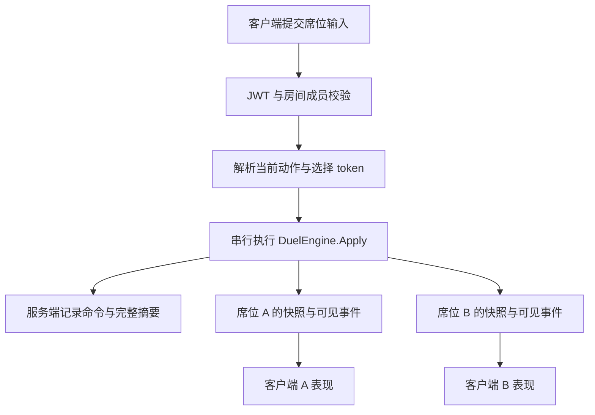

# 决斗系统架构

更新：2026-10-03（Asia/Hong_Kong）。本文描述当前已经落地的逻辑与网络实现。

当前采用**服务端权威的离散命令同步**。服务器保存完整决斗状态，按顺序执行玩家命令和系统命令，向双方分别发送席位可见快照、事件与回执。确定性用于服务器内部重演及规则复现。旧稿中的自研 UDP、封帧广播、三端完整状态副本和独立 `AChen.Duel.Server` 已由下面的实际结构替代。

本轮交付范围是纯 C# 规则与 HTTP/WebSocket 好友房链路。Unity 的网络适配、场景、卡牌表现及画面验收属于后续阶段。本机工作区的消息接入细节另见 [好友房间网络接口](duel-network-contract.md)。

## 1. 当前功能边界

好友房由两个已登录账号通过房间码建立，使用项目现有 JWT 身份。免费构筑使用已实现的卡池，仍受主卡组、额外卡组、同名数量和禁限约束；目前不检查真实库存，也不强制双方已经建立社交好友关系。

当前卡池包含 91 种卡，按青眼、英雄、闪刀归属组织独立规则类。规则覆盖发动、费用、连锁、诱发、持续效果、召唤手续、限制、战斗及结束阶段处理。支持报告用于识别规则缺项，准备和开局会拒绝尚未完整支持的构筑。

主卡组为 40 至 60 张，额外卡组至多 15 张；单局使用 8000 LP，生产开局来源随机选择先手和种子。

完整房间流程为：

```text
JWT 登录 → 创建或加入房间 → 双方提交构筑
         → 双方连接 WebSocket 并准备 → 开局
         → 合法动作 / 响应 / 多步选择 → 终局
         → 返回同一房间 → 调整构筑并重新准备
```

## 2. 代码分层与工程

| 实际位置 | 职责 |
| --- | --- |
| `Assets/Scripts/Duel/Shared/Core` | 状态、命令、事件、时点、移区、召唤、连锁、战斗和阶段义务 |
| `Assets/Scripts/Duel/Shared/Cards` | 印刷资料、卡池、名称目录、素材配方和独立 `CardRules` |
| `Assets/Scripts/Duel/Shared/Effects` | 能力处理器、发动策略、成本、操作上下文与持续记录 |
| `Assets/Scripts/Duel/Shared/Session` | 席位投影、输入解析、规则包、完整状态摘要和私有重演 |
| `Backend/src/AChen.Duel.Core` | 链接上述共享源码的 netstandard2.1 / C# 9 工程 |
| `Backend/src/AChen.Backend.Api/Features/Duels` | JWT 房间、HTTP、WebSocket、计时、连接管理和回放记录 |
| `Backend/tests/AChen.Duel.Tests` | 公共规则、逐卡交互及确定性场景 |
| `Backend/tests/AChen.Backend.Api.Tests` 中的 Duel 文件 | 房间服务和真实 HTTP/WebSocket 交互场景 |
| `Tools/Duel`、`TableData` | 固化目录的生成工具、清单与配置源表 |

共享源码位于现有 `HotUpdate` 代码集内。后端通过源码链接复用规则，不引用整个 Unity 工程或 `HotUpdate.dll`。核心不依赖 Unity、ASP.NET、socket、数据库和宿主时间。

规则入口的实际 API 调用示例；`startRecord`、`command` 和 `seat` 由调用方提供：

```csharp
var catalog = DuelCardCatalog.CreateDefault();
var package = DuelRulePackage.CreateDefault(catalog);
var engine = new DuelEngine(catalog, package.Freeze(startRecord));
DuelStepResult result = engine.Apply(command);
var actions = engine.QueryLegalActions(seat);
```

## 3. 权威执行与隐藏信息



网络输入使用 `SeatInput`。客户端从当前快照读取动作 token、选项 token 和可见卡 ID，并提交对应的目标、素材或费用、场位、表示及宣言名称。服务器按当前版本和席位还原 `DuelCommand`，席位由认证账号确定。

完整 `DuelState`、对手隐藏手牌、牌库顺序、随机状态、挂起执行现场和私有回放留在服务器。`SeatProjection` 分别生成 `DuelSeatSnapshot` 与 `ProjectedDuelEvent`；快照、事件和回执都属于同一保密边界。不能把完整状态或内部命令打包给玩家后再只靠 UI 隐藏。

实际投影入口：

```csharp
var visible = seatProjection.Project(
    engine.State, engine.QueryLegalActions(seat));
```

合法动作查询不修改状态、不消耗随机数。旧版本、旧决策、另一席位的 token 及被替换连接的请求会被拒绝。客户端不能提交 `Timeout`、`DisconnectTimeout` 或 `Abort` 等系统命令。

## 4. 卡牌数据与规则对象

| 类型 | 内容与生命周期 |
| --- | --- |
| `CardDefinition` | 固化的卡号、原名、卡种、属性、数值、系列、箭头、卡文及禁限资料 |
| `CardRules` | 单种卡的全部规则入口，不保存本局可变状态 |
| `DuelCardState` | 一张实体卡的拥有者、控制者、区域、表示、当前属性及局内记录 |
| `CardRef` | 实例 ID 与存在期，供效果对象、装备及素材关系引用 |
| `DuelEffectRecord` | 持续修改、限制、替代及延迟处理所需的数据 |
| `DuelSeatSnapshot` | 指定玩家可以收到的场面、动作和待回答决策 |

同名多张卡共用定义与规则，分别拥有实体状态。拥有者与控制者独立；超量素材、装备关系、正规召唤历史和临时控制权均由公共规则维护。

所有规则移区经过公共操作，明确原因、效果来源、操作者及最后已知信息。引擎统一处理目的地替代、存在期更新、关系解除及离场重置。费用送墓、效果送墓、规则送墓与发动无效清理具有不同语义。

下面是现有公共操作调用形式；具体目标及原因由单卡规则确定：

```csharp
context.Move(card, DuelZone.Graveyard, cause: MoveCause.Effect);
```

## 5. 怎样扩展一张卡

每种卡有一个独立 `CardRules` 文件，并在 `CardRuleCatalog.CreateDefault` 中显式注册。印刷资料继续来自 `CardDefinition`；卡效条件与配方属于各卡规则，素材求解、移区、时点和战斗由公共引擎负责。

`CardRules` 的主要扩展点如下：

| 入口 | 用途 |
| --- | --- |
| `Support` | 声明发动能力、永续、手续和限制的实现状态 |
| `CreateAbilities` | 组合此卡的发动能力和诱发能力 |
| `CreateContinuousRules` | 生成持续适用的规则记录 |
| `CreateSummonProcedures` | 提供不建立连锁的专属特殊召唤手续 |
| `MatchesSummonMaterials` | 检查此卡的素材组合 |
| `CanUseAsMaterial` | 检查这张素材自身的使用限制 |
| `AllowsSummonMethod`、`AllowsEffectSpecialSummon` | 检查召唤方式及效果特召限制 |
| `AllowsMonsterZoneEntry` | 检查进入指定玩家怪兽区域的条件 |
| `ResolveReplacement` | 执行由此卡指定的连锁效果替换程序 |

实际的天空侠规则入口：

```csharp
public sealed class ElementalHEROStratosCard : CardRules
{
    public override string CardId => "40044918";
    public override CardRuleSupport Support => new CardRuleSupport(
        CardRuleRequirement.Done("40044918.1", CardRuleKind.ActivatedAbility));
    public override IEnumerable<IAbilityHandler> CreateAbilities()
    {
        yield return new StratosAbility();
    }
}
```

完整处理器见 [ElementalHEROStratosCard.cs](../../Assets/Scripts/Duel/Shared/Cards/Rules/Hero/ElementalHEROStratosCard.cs)。基类参数与返回值说明见 [CardRules.cs](../../Assets/Scripts/Duel/Shared/Cards/Rules/CardRules.cs)。

能力可组合 `ProgramAbility`、`TriggerProgramAbility`、`ContinuousProgram`、成本及发动策略接口。`IAbilityHandler` 将可发动条件、输入校验、支付费用与效果处理分开。处理器只保存规则配置，局内进度写入连锁或决策数据。

通常怪兽也拥有独立规则类，可以没有专属发动能力。效果卡的支持声明必须覆盖全部规则；仅增加目录条目、卡文或处理器数量不代表完整实现。

## 6. 时点、连锁与连续选择

`DuelPhase` 表示阶段，`BattleStep` 表示战斗步骤，`TimingWindow` 表示当前行动或响应窗口。引擎按照当前窗口查询动作，`Pass` 的意义由窗口决定。

```text
发生移区、召唤或其他事实 → 保存事件组及最后已知信息
→ 到诱发检查点 → 组织双方强制与可选诱发、排序
→ 快速响应 → 双方放弃 → 连锁逆序处理
→ 清理整条连锁 → 下一个诱发检查点或响应窗口
```

事件发生不立即建立新连锁。可选“时”效果检查是否错过时点；准备与结束阶段保留义务处理，回合切换前完成规定的响应及待办。

`DuelChainLink` 保存来源、发动区域、模式、对象、步骤、已付成本、最后已知信息和替换程序。`DuelDecision` 保存回答席位、选择类型、候选、数量及组合限制。处理中需要选择时返回并挂起；合法答案恢复同一连锁项。

下面是挂起处理的示意代码，步骤值仅用于展示写法：

```csharp
if (link.Step == 0)
{
    link.Step = 1;
    context.SelectCards(link, candidates, "选择卡牌", 1, 1);
    return;
}
// 回答后从 link.Step == 1 续接，使用 link.Selected。
```

`Answer` 不重新支付成本。模式、排序、名称宣言、场位及表示选择使用相应类型化答案。发动无效、效果无效、来源离场、对象失效和不受影响分别处理；通常魔陷的清理保留到整条连锁结束。

## 7. 持续效果、召唤与战斗

持续规则每次查询时根据当前来源和条件收集记录；已决持续修改、限制、替代和延迟任务保存在 `DuelEffectRecord` 中。记录使用来源或目标存在期、到期回合、来源依赖和无效重置策略管理生命周期。

召唤操作统一处理素材选择、离场关系、召唤方式、正规召唤历史、怪兽区域与各卡限制。当前接入通常召唤、盖放、表示变更、效果特召，以及卡池使用的融合、同调、超量和连接召唤。

战斗引擎维护攻击宣言、攻击重放、伤害步骤、攻击次数、保护及破坏替代。卡效根据实际破坏结果继续处理，避免替代选择返回后重复执行。

现有破坏操作调用形式：

```csharp
var operation = context.DestroyMany(link, targets);
if (!operation.Completed) return;
// 从 operation.Destroyed 等结果继续后续效果。
```

## 8. 房间、传输与恢复

HTTP 和 WebSocket 均集成在现有 `AChen.Backend.Api` 中。`Program.cs` 注册 `DuelRoomService` 和 `DuelRoomTicker`，启用 WebSocket，并映射需要 JWT 的 `/api/duel/rooms`。

| 方法与路径 | 行为 |
| --- | --- |
| `POST /api/duel/rooms` | 创建房间 |
| `POST /api/duel/rooms/join` | 按房间码加入 |
| `GET /api/duel/rooms/{id}` | 读取本席位房间与决斗快照 |
| `PUT /api/duel/rooms/{id}/deck` | 提交合法构筑并取消本席位准备 |
| `POST /api/duel/rooms/{id}/ready` | 设置准备状态 |
| `GET /api/duel/rooms/{id}/socket?protocolVersion=1` | 建立认证后的 WebSocket |
| `GET /api/duel/rooms/{id}/names` | 按当前合法宣言动作查询名称候选 |
| `POST /api/duel/rooms/{id}/return` | 终局后返回原房间 |
| `DELETE /api/duel/rooms/{id}` | 离开；运行阶段先认输 |

房间状态为 `Waiting`、`Running` 和 `Finished`，暂停由独立标志表达。双方有效连接并准备后开始。修改构筑和重新准备使用同一房间；返回后重建席位投影并清理旧请求和选择现场。

注册表使用短锁维护房间定位及成员关系；每房使用自己的锁串行处理操作。宿主推进到期事件后再处理到达的操作。玩家与系统规则命令统一执行并记录：

```csharp
// DuelRoomService 中的实际执行入口。
var result = room.Engine!.Apply(command);
room.Replay!.Append(command, result, DuelStateDigest.Compute(room.Engine.State));
```

客户端通过 WebSocket 发送 `kind = "command"`、`requestId` 和 `input`，收到包含 `room`、可见 `events` 及可选 `result` 的通知。同一请求编号与相同内容返回原回执；编号被用于不同内容时拒绝。新编号也不能绕过当前版本或决策检查。

每个完整回合，双方行动预算重置为 180 秒，只扣当前应行动或选择者。断线暂停，保留 60 秒；单席未恢复判负，双方未恢复中止。重连替换旧连接，恢复最新快照和未决选择。

连接接收空闲截止为 15 秒，客户端需要定期发送：

```json
{ "kind": "ping" }
```

每个连接使用容量 64 的有界通知频道。拥堵触发连接关闭和暂停，重连后从最新快照恢复。等待房间闲置 30 分钟回收，终局未返回的房间保留 10 分钟。

## 9. 确定性与私有回放

`DuelRulePackage` 固定规则代码版本、协议版本、卡数据、名称目录和禁限摘要。当前规则版本为 `ocg-2026-10-03-v1`，协议版本为 `1`。开局记录冻结构筑、先手、随机种子及规则包身份；核心只使用保存的随机状态推进。

`DuelStateDigest` 按固定字段和顺序编码完整状态，包括牌序、存在期、关系、持续记录、连锁、待回答决策、挂起步骤及随机状态。事件另有规范摘要。网络连接、宿主墙钟和动画不属于规则状态。

`DuelReplayRecorder` 保存冻结开局、初始状态摘要、逐命令结果及状态和事件摘要。`DuelReplayRunner` 从开局重建内核，逐条执行并对照记录；不同规则包或不一致步骤返回具体错误。

实际服务端诊断 API 调用示例：

```csharp
var replay = service.CaptureReplay(roomId);
var verification = DuelReplayRunner.Run(DuelCardCatalog.CreateDefault(), replay);
```

完整回放没有玩家 HTTP/WebSocket 下载路由。返回房间会保留结束对局的回放历史；再次开局创建新记录。当前恢复范围是冻结开局与正式命令，不包含任意手写局面快照。

## 10. 固化数据与两仓库版本

卡牌与名称目录由 `Tools/Duel` 的生成工具固化为纯 C# 数据，资料来源及输出身份记录在生成清单中。运行时使用已提交的数据，不依赖本机外部卡库。名称目录与可构筑卡池独立，名称宣言候选由当前规则和席位决定。

主仓库维护共享源码及数据，Backend 维护宿主、工程和用例。`Backend/shared-source.lock` 记录已推送到主仓库的完整提交 SHA；主仓库 gitlink 记录 Backend 提交。

构建入口检查共享源码、游戏及活动配置、TableData 和 Tools/Duel 与锁定提交一致，并检查对应路径是否存在未提交改动。允许主仓库后续仅更新 Backend 指针或本文等非共享源码文件。

从主仓库根目录使用现有入口：

```powershell
./Backend/scripts/verify-shared-source.ps1 -ParentWorkspace (Get-Location).Path
```

持续集成模板位于 `Backend/scripts/duel-logic-workflow.template.yml`。当前 GitHub 凭据缺少 `workflow` 权限，Actions 尚未启用；模板可在获得权限后安装至 `.github/workflows/duel-logic.yml`。源码版本以锁文件和实际 gitlink 为准，本文不复制易过时的提交编号。

## 11. 下一阶段与已知边界

Unity 后续需要使用现有热更新和 UI 结构，将席位快照及可见事件接到卡牌表现，将玩家输入转为当前合法动作 token，并将决策展示为对应的选卡、排序、场位、表示或名称界面。规则状态与动画节奏分开推进。

```text
最新席位快照 → 更新可见场面与合法操作
可见事件     → 排队播放动画
当前决策     → 展示对应选择 → 提交 token → 等待新快照
```

当前房间、计时和完整回放历史均存于服务端内存，进程重启会中止对局。按账号保存的本地免费构筑、Unity 客户端网络适配与具体表现接入仍待实现。

当前闭合卡池不能形成 Extra Link；公共引擎尚未实现其双额外怪兽区域拓扑。新增能形成该拓扑的卡池时，需要先补齐该公共规则。本文描述的是当前 91 卡范围，后续卡池扩展仍须逐卡补齐规则与实际交互场景。
